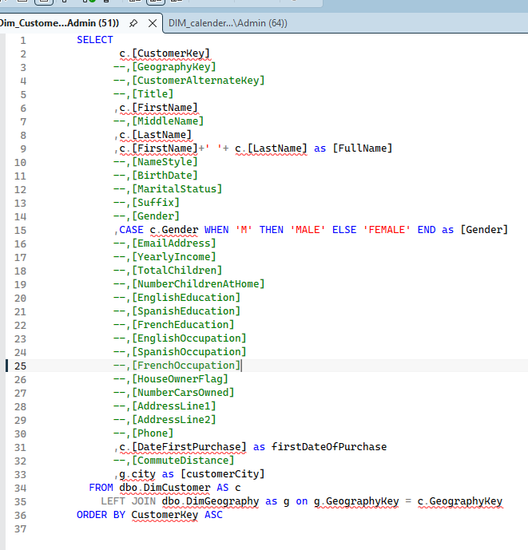
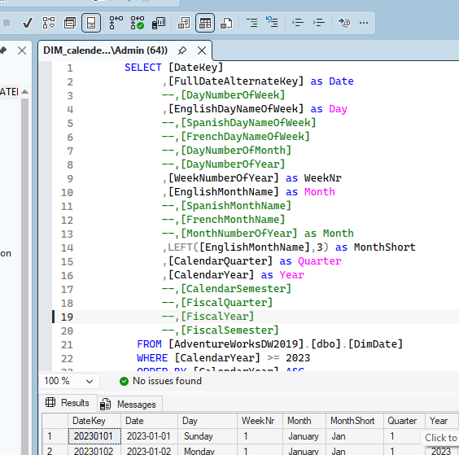
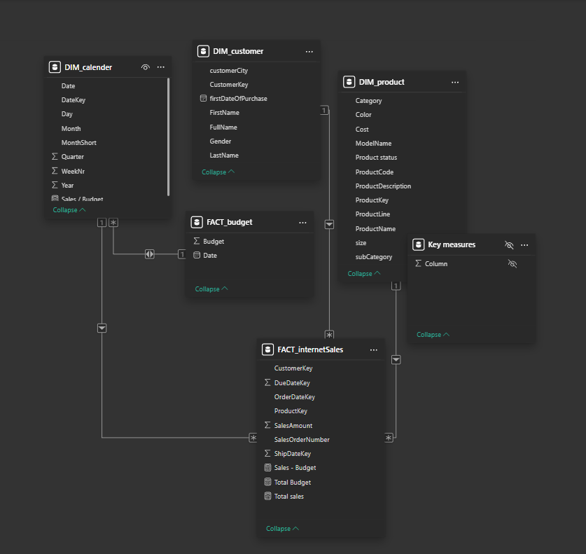
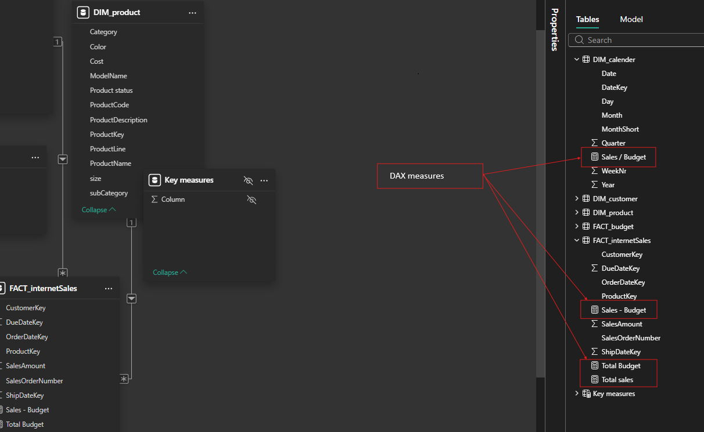

# Project Overview
This project is an end-to-end Sales Analysis solution built using the AdventureWorks MySQL database and Power BI.
The objective was to extract data from a relational database, perform data cleaning and transformation, design a proper data model, and build an interactive dashboard to analyze sales performance, customer behavior, and budget comparison.
The project demonstrates practical data analyst skills including SQL querying, data modeling, DAX calculations, and business insight generation.

## Data Source
Database: AdventureWorks (MySQL)
The dataset was retrieved from a relational database containing:
Sales data (fact table)
Product details
Customer information
Geography data
Budget data
The data was extracted directly from MySQL and imported into Power BI for transformation and modeling.

## SQL Data Extraction
Data was retrieved using structured SQL queries involving:
INNER JOIN to combine Sales, Product, and Customer tables
WHERE clauses for filtering
GROUP BY for aggregation
Basic data validation checks
The SQL layer ensured that the dataset was structured correctly before being loaded into Power BI.

 

## Data Cleaning & Transformation (Power Query)
Data preprocessing was performed using Power Query:
Removed null and irrelevant columns
Renamed fields for clarity
Corrected data types
Created calculated columns where required
Ensured consistent formatting for date and numeric fields
This step ensured data accuracy and analytical readiness.

## Data Modeling
A star schema model was implemented to ensure optimized performance and correct filter context behavior.
Fact Table:
Sales
Dimension Tables:
Product
Customer
Date
Geography
Relationships were defined using one-to-many cardinality to maintain proper analytical structure.

## DAX Measures Implemented
The following key measures were created:
Total Sales
Total Budget
Sales Variance (Actual vs Budget)
Profit
Profit Margin %
Sales by Category
Customer Ranking
Contribution % to Total Sales
Advanced DAX concepts such as CALCULATE, RANKX, and context modification were applied where necessary to ensure accurate results.

## Dashboard – Sales Overview
The final dashboard includes:
KPI card displaying Total Sales with growth indicator
Sales trend over time
Category-wise sales distribution
Top Customers by Sales
Top Sub-Category by Sales
Sales vs Budget monthly comparison
Sales distribution by customer city (map visualization)
Interactive slicers (Year, Month, Category, Sub-Category, Customer City)
The dashboard enables users to dynamically explore performance across different dimensions.

## Key Insights

A single product category contributes the majority of total revenue.
Top customers significantly influence overall sales performance.
Certain months outperform the planned budget.
Sales distribution varies across geographic regions.
Budget alignment differs across product segments.

## Tech Stack:
MySQL,
Power BI,
DAX,
Power Query

## Repository Contents
SQL Scripts
Power BI File (.pbix)
Screenshots (Database, Queries, Modeling, Dashboard)
README Documentation

Project Objective
This project demonstrates the ability to:
Work with relational databases
Write SQL for structured data retrieval
Clean and transform raw datasets
Design efficient data models

Create meaningful business dashboards

Generate actionable insights from data
